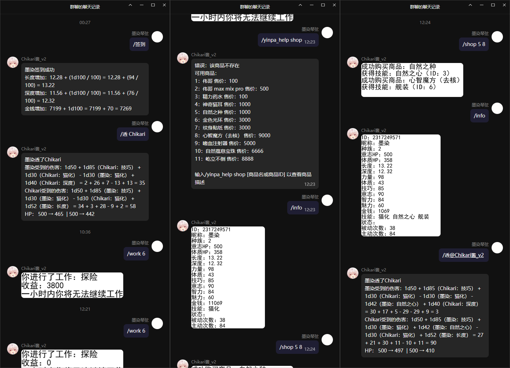

  
   
  

# nonebot-plugin-chikari-yinpa

_✨ NoneBot 一个普通的银趴插件 ✨_

## 📖 介绍

### 警告：本插件包含NSFW内容！
### 本项目迭代较快，请时刻注意并更新至新版本
这是一个基于NoneBot 2的银趴插件

## 💿 安装

使用 nb-cli 安装

在 nonebot2 项目的根目录下打开命令行, 输入以下指令即可安装

    nb plugin install nonebot-plugin-chikari-yinpa

使用包管理器安装

在 nonebot2 项目的插件目录下, 打开命令行, 根据你使用的包管理器, 输入相应的安装命令

pip

    pip install nonebot-plugin-chikari-yinpa

pdm

    pdm add nonebot-plugin-chikari-yinpa

poetry

    poetry add nonebot-plugin-chikari-yinpa

conda

    conda install nonebot-plugin-chikari-yinpa

打开 nonebot2 项目根目录下的 `pyproject.toml` 文件, 在 `[tool.nonebot]` 部分追加写入

    plugins = ["nonebot_plugin_chikari_yinpa"]

## ⚙️ 配置

在 nonebot2 项目的`.env`文件中添加下表中的必填配置

| 配置项 | 必填 | 默认值 | 说明 |
|:-----:|:----:|:----:|:----:|
| chikari_yinpa_initial_sex_value | 否 | 50 | 目前无作用 |
| chikari_yinpa_initial_penis_length | 否 | 10 | 初始长度。默认：10 |
| chikari_yinpa_initial_vagina_depth | 否 | 10 | 初始深度。默认：10 |
| chikari_yinpa_initial_money | 否 | 100 | 初始金钱。默认：100 |

## 🎉 使用
### 指令表
#### help指令中的提示以"/"为指令前缀，可根据实际情况自行修改
#### 部分指令存在别名，可在help指令中查询
| 指令 | 权限 | 需要@ | 范围 | 说明 |
|:-----:|:----:|:----:|:----:|:----:|
| yinpa_control | 主人/群主/管理员 | 否 | 群聊 | 控制本群银趴的开启/关闭 |
| help | 无 | 否 | 私聊/群聊 | 查询Chikari_yinpa的帮助 |
| sign_in | 无 | 否 | 私聊/群聊 | 每日打卡，每天可使用一次，增加长度、深度、金钱 |
| yinpa_join | 无 | 否 | 私聊/群聊 | 加入银趴！ |
| yinpa_leave | 无 | 否 | 私聊/群聊 | 离开银趴！ |
| info | 无 | 否 | 私聊/群聊 | 查询自己或某人的银趴信息 |
| tou | 无 | 否 | 私聊/群聊 | 透某人 |
| zha | 无 | 否 | 私聊/群聊 | 榨某人 |
| chong | 无 | 否 | 私聊/群聊 | 冲一发，能够增加或减少一定长度 |
| kou | 无 | 否 | 私聊/群聊 | 扣一次，能够增加少量深度 |
| shop | 无 | 否 | 私聊/群聊 | 花费金钱购买商品 |
| work | 无 | 否 | 私聊/群聊 | 工作，获得金钱及其他东西 |

## 🥳 体验 & 预览图
### 测试/体验群（QQ）：817078765

